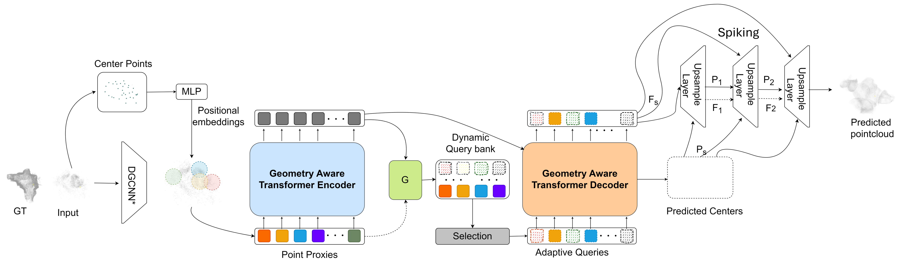

# UpPoinTr With SNN Upscaler

This repo is based off of the code for UpPoinTr

UpPoinTr Architecture:





We created a new model called SpikingUpsamplingUpPoinTr. This converts the upsample transformer used in the upsampleing layers at the end of the UpPoinTr model into a spiking neural network. 

We highly recommend checking out the original UpPoinTr pipeline:
[UpPoinTr](https://github.com/ajaymopidevi/UpPoinTr)

We used [RMap](https://github.com/arpg/RMap) to create the point clouds below 


The rest of this document is the same as UpPoinTr but with slight adjustments for our model including the additional requirement of spikingjelly which was used to create the SNN.
## Usage
### Requirements

```
conda env create -f UpPoinTr.yaml
```

or manually install

- PyTorch >= 1.7.0
- python >= 3.7
- CUDA >= 9.0
- GCC >= 4.9 
- torchvision
- timm
- open3d
- tensorboardX
- spikingjelly

```
pip install -r requirements.txt
```

#### Building Pytorch Extensions for Chamfer Distance, PointNet++ and kNN

*NOTE:* PyTorch >= 1.7 and GCC >= 4.9 are required.

```
# PointNet++
pip install "git+https://github.com/erikwijmans/Pointnet2_PyTorch.git#egg=pointnet2_ops&subdirectory=pointnet2_ops_lib"
# GPU kNN
pip install --upgrade https://github.com/unlimblue/KNN_CUDA/releases/download/0.2/KNN_CUDA-0.2-py3-none-any.whl
```
If there are any errors at this step, follow instructions in [CUDA-Install](./CUDA_install.md)

```
# Chamfer Distance
bash install.sh
```


### Dataset

The details of our new ***ColoRadar*** dataset can be found in [ColoRadarDATASET.md](./ColoRadarDATASET.md).

### Pretrained Models
| dataset  | url| performance |
| --- | --- |  --- |
| PCN | [OneDrive](https://o365coloradoedu-my.sharepoint.com/:u:/g/personal/ajmo2266_colorado_edu/EYXF84I88wBIq9XN2dKugloBMuE_XPJfZxY6crIBNN4hDw?e=JFoAiH) | F-Score 0.848 |
| ColoRadar | --- | F-Score 0.441 | 


### Inference

To inference sample(s) with pretrained model

```
python tools/inference.py \
${SpikingUpsampleUpPOINTR_CONFIG_FILE} ${SpikingUpsampleUpPOINTR_CHECKPOINT_FILE} \
[--pc_root <path> or --pc <file>] \
[--save_vis_img] \
[--out_pc_root <dir>] \
```

For example, inference all samples under `demo/` and save the results under `inference_result/`
```
python tools/inference.py \
cfgs/ColoRadar_models/SpikingUpsampleUpPoinTr.yaml ckpts/SpikingUpsampleUpPoinTr.pth \
--pc_root demo/ \ 
--save_vis_img  \
--out_pc_root inference_result/ \
```

### Evaluation

To evaluate a pre-trained PoinTr model on the Three Dataset with single GPU, run:

```
bash ./scripts/test.sh <GPU_IDS>  \
    --ckpts <path> \
    --config <config> \
    --exp_name <name> \
    [--mode <easy/median/hard>]
```

####  Some examples:
Test the UpPoinTr pretrained model on the ColoRadar dataset:
```
bash ./scripts/test.sh 0 \
    --ckpts ./pretrained/SpikingUpsampleUpPoinTr.pth \
    --config ./cfgs/ColoRadar_models/SpikingUpsampleUpPoinTr.yaml \
    --exp_name example
```

### Training

To train a point cloud completion model from scratch, run:

```
# Use DistributedDataParallel (DDP)
bash ./scripts/dist_train.sh <NUM_GPU> <port> \
    --config <config> \
    --exp_name <name> \
    [--resume] \
    [--start_ckpts <path>] \
    [--val_freq <int>]
# or just use DataParallel (DP)
bash ./scripts/train.sh <GPUIDS> \
    --config <config> \
    --exp_name <name> \
    [--resume] \
    [--start_ckpts <path>] \
    [--val_freq <int>]
```
####  Some examples:
Train  SpikingUpsampleUpPoinTr model on ColoRadar benchmark with 2 gpus:
```
CUDA_VISIBLE_DEVICES=0,1 bash ./scripts/dist_train.sh 2 13232 \
    --config ./cfgs/ColoRadar_models/SpikingUpsampleUpPoinTr.yaml \
    --exp_name example
```
Resume a checkpoint:
```
CUDA_VISIBLE_DEVICES=0,1 bash ./scripts/dist_train.sh 2 13232 \
    --config ./cfgs/ColoRadar_models/SpikingUpsampleUpPoinTr.yaml \
    --exp_name example --resume
```


## Kennesaw State University 


## UpPoinTr Citations
```
@article{mopidevi2023rmap,
  title={RMap: Millimeter-Wave Radar Mapping Through Volumetric Upsampling},
  author={Mopidevi, Ajay Narasimha and Harlow, Kyle and Heckman, Christoffer},
  journal={arXiv preprint arXiv:2310.13188},
  year={2023}
}

@inproceedings{yu2021pointr,
  title={PoinTr: Diverse Point Cloud Completion with Geometry-Aware Transformers},
  author={Yu, Xumin and Rao, Yongming and Wang, Ziyi and Liu, Zuyan and Lu, Jiwen and Zhou, Jie},
  booktitle={ICCV},
  year={2021}
}
```
